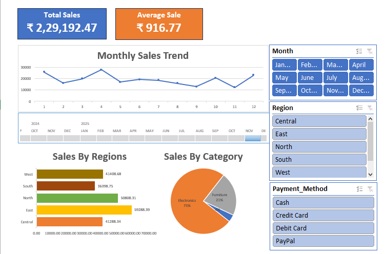

# Sales-Dashboard
## Dashboard Preview

## Overview
This project is an interactive Sales Dashboard built in Microsoft Excel to analyze sales performance, identify trends, and generate business insights using data visualization and analytical techniques.

## Features
- Interactive Dashboard with Slicers
- Monthly Sales Trend Analysis
- Regional Sales Performance Analysis
- Category-wise Sales Distribution
- KPI Tracking (Total Sales, Average Sales)
- Pivot Tables and Pivot Charts
- Regression Analysis for trend identification

## Tools Used
- Microsoft Excel
- Pivot Tables
- Pivot Charts
- Slicers
- Excel Functions
- Regression Analysis

## Key Insights
- Analyzed sales trends across multiple months.
- Identified top-performing regions and product categories.
- Evaluated sales patterns using regression analysis.
- Created an interactive dashboard for business reporting.
